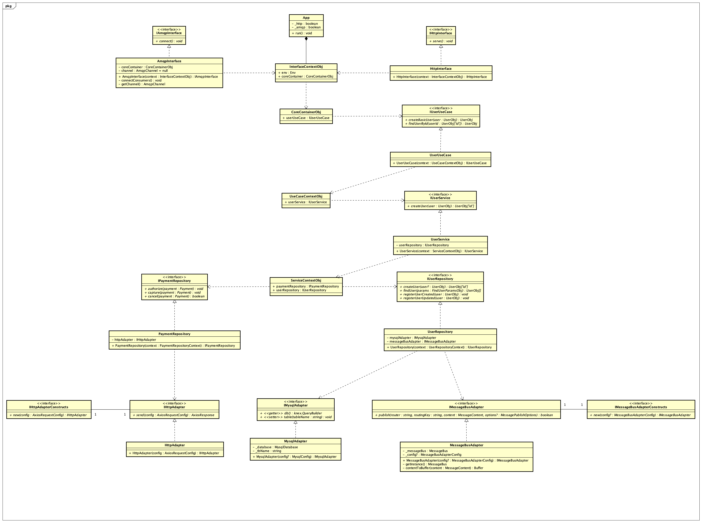

# hexagonal-architecture
Repository that contains some project that have been designed following the hexagonal architecture

## Description

This project is an API that can handle users, online banking transfers and payments. The documentations are at:
- [HTTP](./docs/openapi.yaml)
- [AMQP](./docs/asyncapi.yaml)
- CLI (to be defined...)

## Design 

### Class Diagram

#### Typescript

---

## Resources 
- [DDD, Hexagonal, Onion, Clean, CQRS,… - How I put it all together](https://herbertograca.com/2017/11/16/explicit-architecture-01-ddd-hexagonal-onion-clean-cqrs-how-i-put-it-all-together/)
- [UML Design - Guru99](https://www.guru99.com/uml-diagrams.html)
